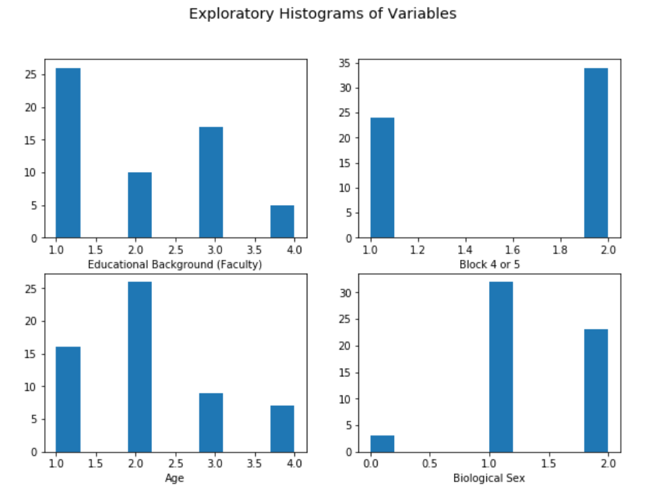
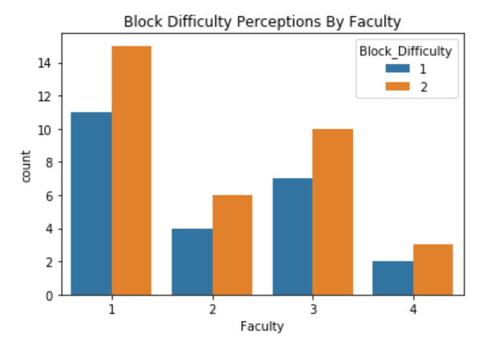
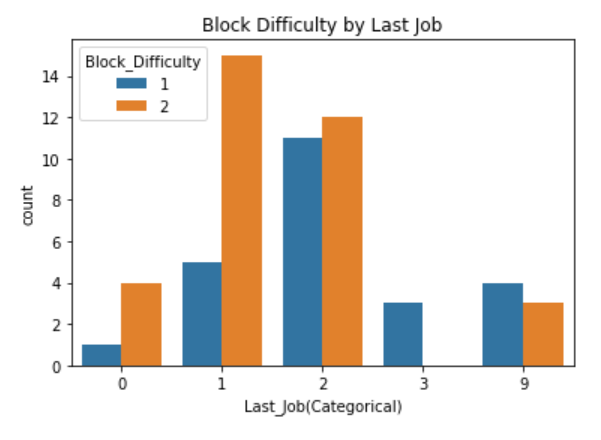

## Question

As students in MDS who are completing their degree, we were curious about the experience of our classmates over the course of the program. There is a general consensus that the two toughest blocks (4 courses per block) of month long material were covered in January and February, which were blocks 4 and 5. While both were considered difficult they were quite different in educational content.

Block 4 contained coursework on extensive concepts in machine learning, ranging from ML algorithms, deep learning, feature and model selection, regularization, among other topics generally taught within the computing science department. On the other hand, Block 5 contained statistics courses covering regression, time-series/spatial statistics, and Bayesian statistics. 

Our interest in this experiment was to consider the background of students, and the role this played in their perception of the more difficult block (4 or 5).

Our hypothesis is that students with a statistics/math/life science background (education or occupation) will rate the machine learning block (Block-4) as the harder block, whereas students with a computer-science background (education or occupation) will rate the statistics block (Block-5) as the more difficult one. We believe there is a relationship between educational focus, occupational history and efficacy in school, and that this can be measured by individual perceptions of difficulty using our outcome question.

## Methods
### Survey Study Design
Our survey was designed with six questions we used to gauge a persons background, as well as their perception of whether block 4 or block 5 was more difficult. 

The included questions were:

##### Which faculty is your undergraduate degree from?
  - This question was categorical including options such as "business" and "science" with the option to add a faculty if we happened to miss one. 
  - We designed this question to deduce whether experience in one faculty will contribute to more experience in statistics or computer science which would ultimately contribute to perception of difficulty. 

##### What is your undergraduate major?
  - This question was a free text field which we manually binned. 
  - We designed this question to differentiate between computer science majors and statistics majors who both fall under the "science" faculty. 
  
##### What was your last job?
  - This question was a free text field which we manually binned.
  - We designed this question to deduce whether past work experience contributed to the difficulty of block perception.
  
##### Which age group do you belong to?
  - This question was categorical with options in 5 year age groups from 19 - 35+.
  - We designed to deduce whether or not age was a confounding factor in choice of undergraduate degree or last job.
  
##### What is your sex?
  - This question was categorical with options including "Female", "Male" and "Prefer not to say". 
  - We designed to deduce whether or not sex was a confounding factor in choice of undergraduate degree or last job.

##### Which block did you find more difficult?
  - This question was binary with the choices of either block 4 or block 5.
  - This was our response variable.

### Data Collection Methods
  - Survey
  - Manual binning of free text categoricals

```{r, echo=FALSE}
# import packages
suppressPackageStartupMessages(library(tidyverse))
suppressPackageStartupMessages(library(dplyr))
suppressPackageStartupMessages(library(knitr))
suppressPackageStartupMessages(library(kableExtra))
suppressPackageStartupMessages(library(broom))
```

```{r, echo=FALSE} 
# import data
data <- read.csv("../data/data.csv") 

data <- data %>% 
  
  mutate(
    
    # DV - binary: 0 - block 4 harder; 1 - block 5 harder
    Y = ifelse(Which.block.did.you.find.more.difficult. == "Block 4 (January)", 0, 1),
    
    sex = ifelse(What.is.your.sex. == "Male", "M", "F")) %>%
  
  select(faculty = Faculty,
         
         age = Which.age.group.do.you.belong.to.,
         
         last_job = Last_Job.Categorical.,
         
         sex,
         
         Y)

data$faculty <- factor(data$faculty)
# faculty = 1: Science
# faculty = 2: Business
# faculty = 3: Engineering
# faculty = 4: Arts

data$last_job <- factor(data$last_job)
# last_job = 0: Unemployed or N/A
# last_job = 1: Science
# last_job = 2: Business
# last_job = 3: Engineering
# last_job = 9: Arts

data$sex<- factor(data$sex)

kable(summary(data))
```

> faculty = 1: Science
<br> faculty = 2: Business
<br> faculty = 3: Engineering
<br> faculty = 4: Arts
<br>
<br> last_job = 0: Unemployed or N/A
<br> last_job = 1: Science
<br> last_job = 2: Business
<br> last_job = 3: Engineering
<br> last_job = 9: Arts

## Analysis Methods
- TODO:

## Results and Analysis

### EDA

We can find the overall distribution for each variable from histograms of `Faculty`, `Block_Difficulty`, `Age` and `Sex` above.





When looking at the `Block_Difficulty` for each group of `Faculty` and `Last_job`, it shows that `Faculty` doesn't affect `Block_Difficulty` much, but `Last_job` does.

### Model 1: 1 IV (only faculty)

First, fit the simple logistic regression model with just one IV (`faculty`):

```{r}
# model 1: 1 IV (only faculty)
mod1 <- glm(Y ~ faculty, data = data, family = "binomial")
kable(tidy(mod1))
```

- Since all of the p-values are larger than 0.05, we don't have siginificant evidence to show any of the faculty class is siginificant to determine the perception of block difficulty.

- The intercept of 0.31015 is the log odds for `faculty1` to find block 5 harder since it is the reference group.

- The coefficient for `faculty2` is the difference of log of odds ratio between the `faculty2` group and `faculty1` group, which is 0.09531. Similarly, we can interpret the corresponding coefficients for `faculty3` and `faculty4`.

### Model 2: 2 IV (`faculty` and `last_job`) without Interaction Terms

From EDA, we found last_job might be another IV, therefore we test that by adding it to our logistic regression model using no interaction terms:

```{r}
# model 2: 2 IV (faculty and last_job) without interaction term
mod2 <- glm(Y ~ faculty + last_job, data = data, family = "binomial")
kable(tidy(mod2))
```

- Since all of the p-values are larger than 0.05, we don't have siginificant evidence to show any of the faculty or last_job class is siginificant to determine the perception of block difficulty.

- The intercept of 1.2458 is the log odds for `faculty1` and `last_job0` of finding block 5 harder since it is the reference group.

- The coefficient for `faculty2` is the difference of log of odds ratio between the `faculty2` group and `faculty1` group holding the same `last_job` group, which is 0.2326. Similarly, we can intepret corresponding coefficients for `faculty3` and `faculty4`.

- The coefficient for `last_job1` is the difference of log of odds ratio between the `last_job1` group and `last_job0` group holding the same `faculty` group, which is -0.3291. Similarly, we can intepret the corresponding coefficients for `last_job2`, `last_job3` and `last_job9`.

### Chi-square Deviance Test - Comparison of `model 1` and `model 2`

```{r, warning=FALSE}
kable(tidy(anova(mod1, mod2, test="Chisq")))
```

- The result shows a Df of 4, indicating that the more complex model (`model 2`) has 4 additional parameters.

- Since p-value < 0.05, adding the IV `last_job` to the model does lead to a significantly improved fit over the `model 1`.

### Model 3: 2 IV (`faculty` and `last_job`) with Interaction Terms

```{r}
# model 3: 2 IV (faculty and last_job) with interaction term
mod3 <- glm(Y ~ faculty * last_job, data = data, family = "binomial")
kable(tidy(mod3))
```


- Since all of the p-values are larger than 0.05, we don't have siginificant evidence to show any of class or interaction term is siginificant to determine the perception of block difficulty.

- The intercept of 0.6931 is the log odds for `faculty1` and `last_job0` group to find block 5 harder since it is the reference group.

- The coefficient for `faculty2` is the difference of log of odds ratio between the `faculty2` group and `faculty1` group for the `last_job0` group, which is 0.5108. Similarly, we can intepret corresponding coefficients for `faculty3` and `faculty4`.

- The coefficient for `last_job1` is the difference of log of odds ratio between the `last_job1` group and `last_job0` group for the `faculty1` group, which is 0.5596. Similarly, we can intepret the corresponding coefficients for `last_job2`, `last_job3` and `last_job9`.

- The coefficient for `faculty2:last_job1` is the difference is the difference between the log-odds ratio comparing `faculty2` vs `faculty1` in `last_job1` and the log-odds ratio comparing `faculty2` vs `faculty1` in `last_job0`. Similarly, we can intepret the corresponding coefficients for the other interaction terms.

### Chi-square Deviance Test - Comparison of `model 2` and `model 3`

```{r, warning=FALSE}
kable(tidy(anova(mod2, mod3, test="Chisq")))
```

- The result shows a Df of 5, indicating that the more complex model (`model 3`) has 5 additional parameters.

- Since p-value > 0.05, adding the interaction term to the model does NOT lead to a significantly improved fit over the `model 2`.

## Discussion of Results

By employing the three models to our data, we find for all our models, none of the variables are relevant to the perception of block difficult. From the model comparisions, adding the IV `last_job` to the model does lead to a significantly improved fit over the `model 1` (only 1 IV faculty). Also, the interaction term of `faculty` and `last_job` is not significant.

## Discussion of your Survey/Study design
  - Discuss possible burnout factors and time factors
  - Perhaps next time we assess difficulty after each block individually, rather than relying on retrospective memory of participants
